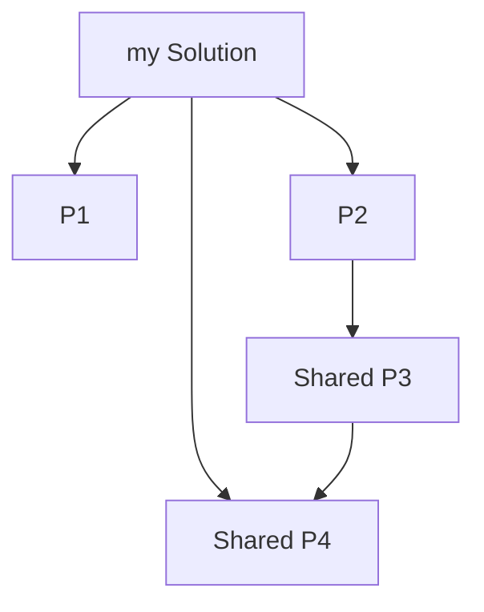
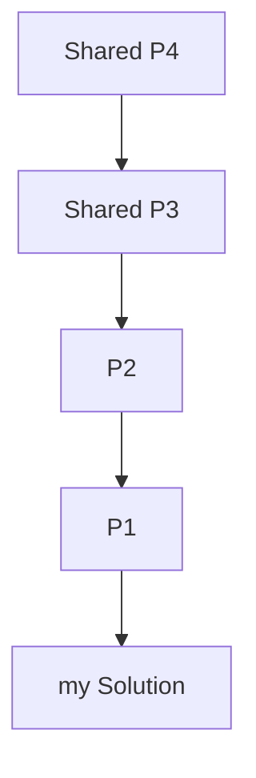
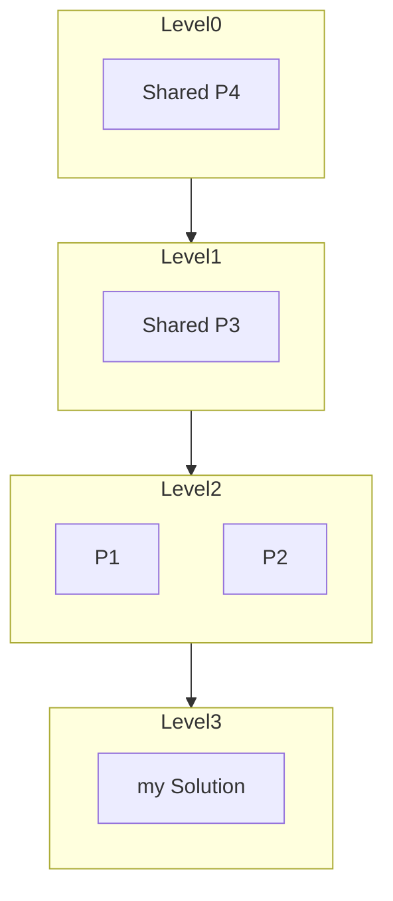
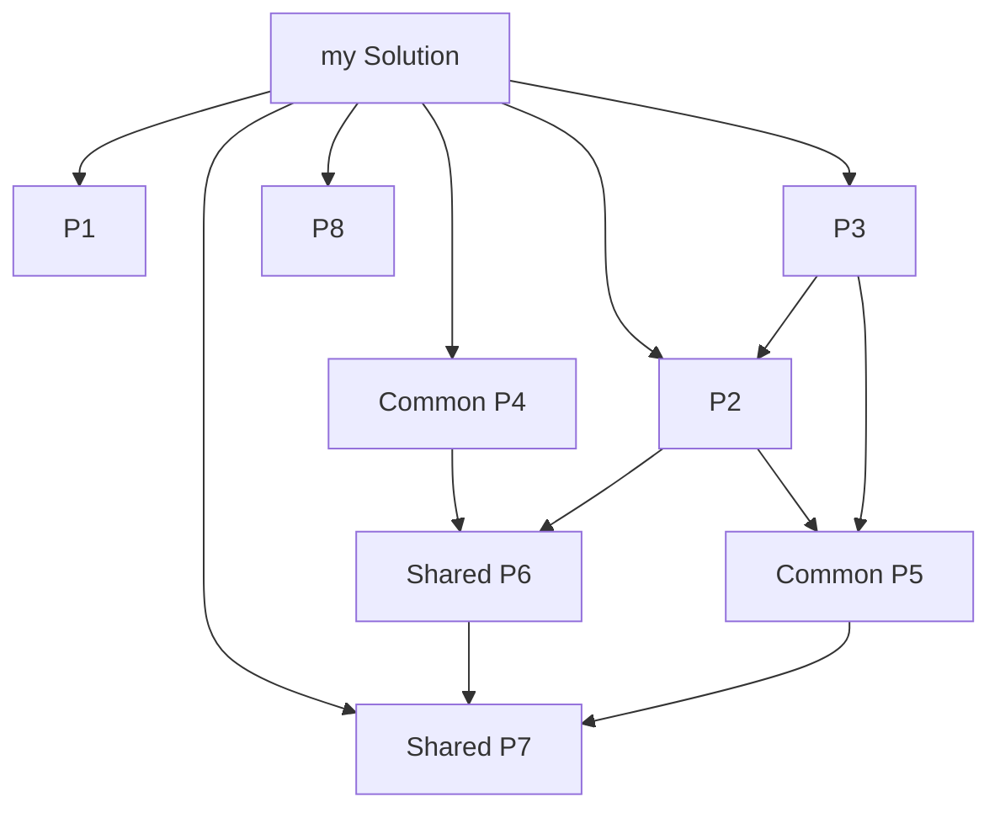
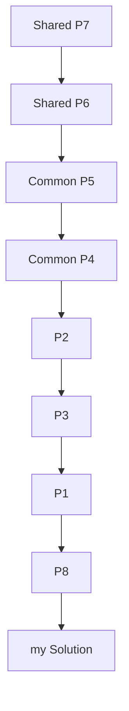
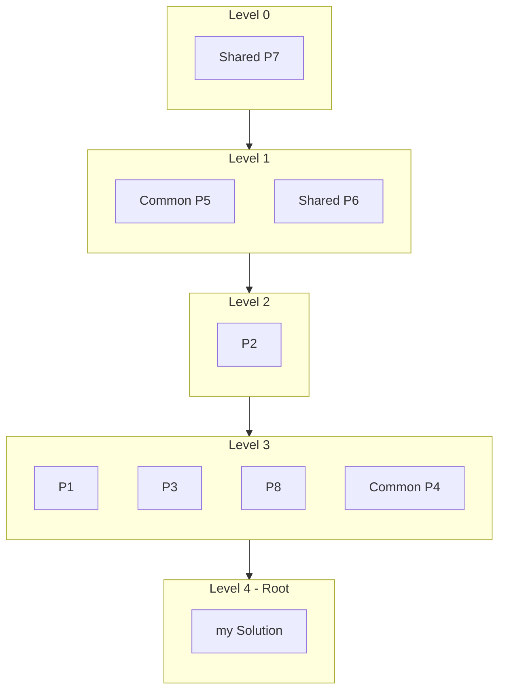

## DeeplyDepBuilder

Deeply Dependency Builder is a command lime tool to build the complete prject reference depenndency graph of the solution or project.
In big projects or monorepos, the dependecy chain can be very deep. The usual dotnet build only builds your current project and not referenced package.
Visual Studio had option to do that I guess, but not in VsCode or Rider.

The Features of this tool
- Identifies Dependency Cycle
- Create Mermaid Graph as your solution as Root.
- Uses Topological Sort with levels. Each level represents independent projects.
- Each level can be build parallely for speeding up build process.
- Levels and topo sort is also shown in graph.
- Can clean the build of the whole graph.


## Installing as a dotnet tool

```bash
dotnet pack
dotnet tool install --global --add-source ./nupkg deeplydepbuilder

# Once installed run the command
deeplydep --help
```
> If you are using it alot, consider generate a alias as `dpd`

## Usage

You can run the tool by passing the required project or solution path. 

```bash
deeplydep -p /path/to/your/project.csproj
```


if running from the source:
```bash
dotnet run -- -p <Path-to-Solution-Or-Project>
```

### CLI Options

**Required**:

```bash
-p, --project                Required. .Net Project or Solution Full Path
```

**Optional**:

```
  -v, --verbose                Add Trace Logging

  -c, --clean                  (Default: false) Do Dotnet Clean instead of Dotnet Build

  -g, --generate-graph-path    Generate markdown file for graph visualization in given path

  --hide-path-in-graph         (Default: false) In visual graph, if false shows path otherwise File name. Use only when names are unique

  --no-parallel                (Default: false) If false builds projects in the same level in parallelly otherwise sequentially

  --show-build-output          (Default: false) If True shows the build output in the console.

  --help                       Display this help screen.

  --version                    Display version information.
  
  ```

## Example with Graphs

 This Repo: https://github.com/Shaikh-Imran/dotnet-mono-repo-example is generated based on this graph.

> Note: To Test out Cycle Detection use the branch `cyclic-dep` or this url: https://github.com/Shaikh-Imran/dotnet-mono-repo-example/tree/cyclic-dep

### Simple Example

Project Structure



Topological Sort



Topological Sort with Levels

### Complex Example
Project Structure



Topological Sort



Topological Sort with Level Groups



### Examples

Use this https://github.com/Shaikh-Imran/dotnet-mono-repo-example solution for testing.

**Build a project:**
```bash
deeplydep -p /path/to/your/project.csproj
```

**Clean a solution instead of building:**
```bash
deeplydep -p /path/to/your/solution.sln -c
```

**Generate a dependency graph markdown file and build:**
```bash
deeplydep -p /path/to/your/solution.sln -g /path/to/output/graph.md
```

**Build sequentially and show dotnet build output:**
```bash
deeplydep -p /path/to/your/solution.sln --no-parallel --show-build-output
```


## TODO
- [x] Graph Visulization
- [x] Graph Cycle Detection
- [x] Graph Level Grouping
- [x] Graph Level Parallel Build
- [x] Clean Build
- [ ] No build if latest build is up to date
- [ ] Path Shortening in graph for better visualization
- [ ] Terminal Graph Visualization??
